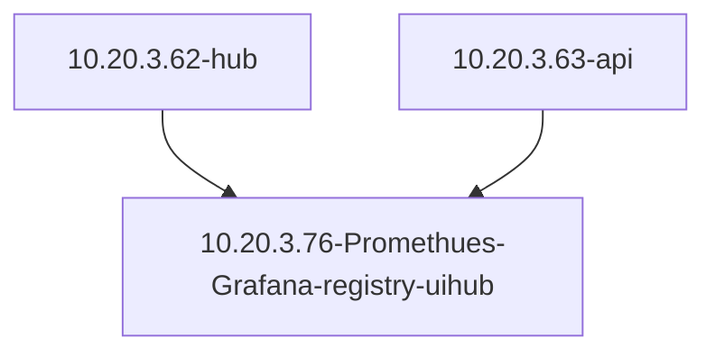

```mermaid
graph TD

10.20.3.62-hub --> 10.20.3.76-Promethues-Grafana-registry-uihub
10.20.3.63-api --> 10.20.3.76-Promethues-Grafana-registry-uihub
```

1. Hub can be spawned on any VM (virtual machine) ? So, this IP:10.20.3.62 and port will always change when spawned.